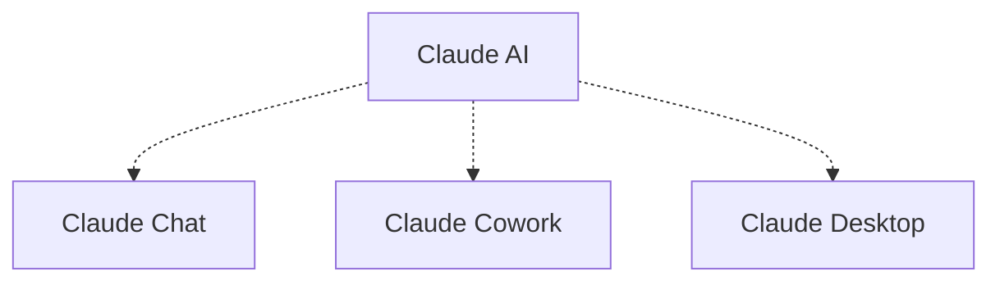
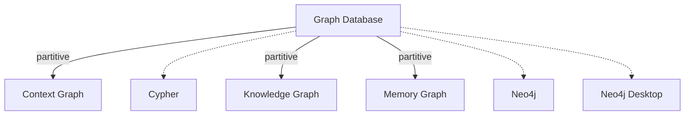
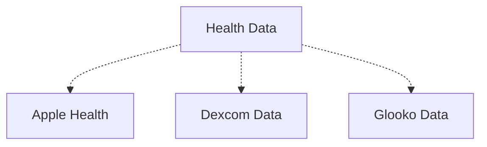
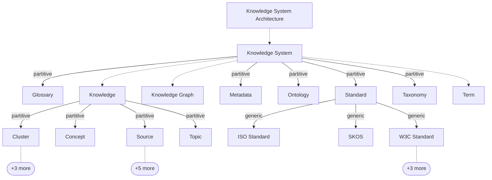
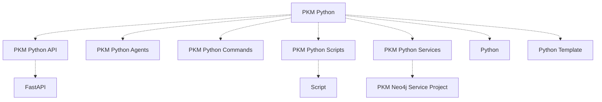
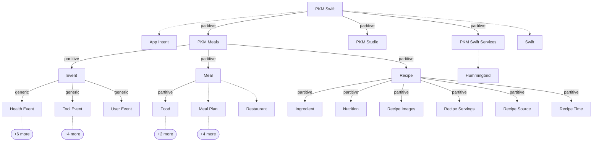
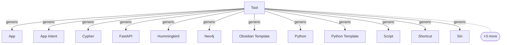

# Map

The same hierarchy as [the tree](../hierarchy/), drawn. One diagram per top
concept, because a single graph of 223 concepts is a hairball rather than an
explanation — the useful unit is a chunk small enough to take in at once.

**Read the arrows.** A solid arrow carries its ISO 25964 kind: `generic` for a
kind-of, `partitive` for a part-of, `instantial` for a named individual under
the class it instantiates. **A dotted arrow has no kind at all** — the
vocabulary asserts `skos:broader` and stops there. A third of this hierarchy is
in that state, so the dotted arrows are not noise; they are the work still
outstanding.

These diagrams are generated from the published graph on every build, so they
cannot drift from it. They describe what the vocabulary *is*, not what it
should become.

<!-- pkm:begin generated -->
<!-- Generated by `make build`. Edits between these markers are overwritten. -->

Solid arrows are qualified by ISO 25964 and carry the word — `generic` for a kind-of, `partitive` for a part-of, `instantial` for a named individual. **A dotted arrow has no qualifier at all**, and a third of this hierarchy is in that state; see the roadmap for the count and which links they are.

Each chunk is drawn 3 levels deep, at most 12 children per node. `+N more` marks what is not shown; the term's own page lists it in full.

## Claude AI

[Claude AI](../../ClaudeAI/) — 3 descendants.

## Graph Database

[Graph Database](../../GraphDatabase/) — 6 descendants.

## Health Data

[Health Data](../../HealthData/) — 3 descendants.

## Knowledge System Architecture

[Knowledge System Architecture](../../KnowledgeSystemArchitecture/) — 91 descendants.

## Obsidian Notes

[Obsidian Notes](../../ObsidianNotes/) — 108 descendants.

```mermaid
graph TD
  ObsidianNotes["Obsidian Notes"]
  Base["Base"]
  ObsidianNotes -.-> Base
  Map["Map"]
  ObsidianNotes -.-> Map
  Note["Note"]
  ObsidianNotes -.-> Note
  ObsidianPlugin["Obsidian Plugin"]
  ObsidianNotes -.-> ObsidianPlugin
  AdvancedURI["Advanced URI"]
  ObsidianPlugin -.-> AdvancedURI
  Bases["Bases"]
  ObsidianPlugin -.-> Bases
  BookSearch["Book Search"]
  ObsidianPlugin -.-> BookSearch
  Canvas["Canvas"]
  ObsidianPlugin -.-> Canvas
  Dataview["Dataview"]
  ObsidianPlugin -.-> Dataview
  Excalidraw["Excalidraw"]
  ObsidianPlugin -.-> Excalidraw
  LocalRESTAPIWithMCP["Local REST API with MCP"]
  ObsidianPlugin -.-> LocalRESTAPIWithMCP
  PeriodicNotes["Periodic Notes"]
  ObsidianPlugin -.-> PeriodicNotes
  Publish["Publish"]
  ObsidianPlugin -.-> Publish
  QuickAdd["QuickAdd"]
  ObsidianPlugin -.-> QuickAdd
  Sync["Sync"]
  ObsidianPlugin -.-> Sync
  Templater["Templater"]
  ObsidianPlugin -.-> Templater
  ObsidianPlugin__rest(["+1 more"])
  ObsidianPlugin -.- ObsidianPlugin__rest
  ObsidianTemplate["Obsidian Template"]
  ObsidianNotes -.-> ObsidianTemplate
  PythonTemplate["Python Template"]
  ObsidianNotes -->|partitive| PythonTemplate
  TemplateCopy["Template"]
  ObsidianNotes -->|partitive| TemplateCopy
  Vault["Vault"]
  ObsidianNotes -->|partitive| Vault
  AddFolder["Add Folder"]
  Vault -->|partitive| AddFolder
  Draft["Draft"]
  AddFolder -->|partitive| Draft
  Focus["Focus"]
  AddFolder -->|partitive| Focus
  Idea["Idea"]
  AddFolder -->|partitive| Idea
  Spark["Spark"]
  AddFolder -->|partitive| Spark
  ArchiveFolder["Archive Folder"]
  Vault -->|partitive| ArchiveFolder
  AtlasFolder["Atlas Folder"]
  Vault -->|partitive| AtlasFolder
  CalendarFolder["Calendar Folder"]
  Vault -->|partitive| CalendarFolder
  Calendar["Calendar"]
  CalendarFolder -->|partitive| Calendar
  Calendar__more(["+7 more"])
  Calendar -.- Calendar__more
  DayCluster["Day Cluster"]
  CalendarFolder -->|partitive| DayCluster
  DayCluster__more(["+4 more"])
  DayCluster -.- DayCluster__more
  MonthCluster["Month Cluster"]
  CalendarFolder -->|partitive| MonthCluster
  MonthCluster__more(["+5 more"])
  MonthCluster -.- MonthCluster__more
  QuarterCluster["Quarter Cluster"]
  CalendarFolder -->|partitive| QuarterCluster
  QuarterCluster__more(["+5 more"])
  QuarterCluster -.- QuarterCluster__more
  TimeCluster["Time Cluster"]
  CalendarFolder -->|partitive| TimeCluster
  TimeCluster__more(["+5 more"])
  TimeCluster -.- TimeCluster__more
  WeekCluster["Week Cluster"]
  CalendarFolder -->|partitive| WeekCluster
  WeekCluster__more(["+10 more"])
  WeekCluster -.- WeekCluster__more
  YearCluster["Year Cluster"]
  CalendarFolder -->|partitive| YearCluster
  YearCluster__more(["+5 more"])
  YearCluster -.- YearCluster__more
  EffortsFolder["Efforts Folder"]
  Vault -->|partitive| EffortsFolder
  Action["Action"]
  EffortsFolder -->|generic| Action
  Area["Area"]
  EffortsFolder -->|generic| Area
  Area__more(["+3 more"])
  Area -.- Area__more
  Interest["Interest"]
  EffortsFolder -->|generic| Interest
  Project["Project"]
  EffortsFolder -->|generic| Project
  ExtraFolder["Extra Folder"]
  Vault -->|partitive| ExtraFolder
  Ideaverse["Ideaverse"]
  Vault -.-> Ideaverse
  ACEOrganization["ACE Organization"]
  Ideaverse -.-> ACEOrganization
  ARCIdeation["ARC Ideation"]
  Ideaverse -.-> ARCIdeation
  IdeaEmergence["Idea Emergence"]
  Ideaverse -.-> IdeaEmergence
  ObsidianSettings["Obsidian Settings"]
  Vault -.-> ObsidianSettings
  View["View"]
  ObsidianNotes -.-> View
```

## PKM Python

[PKM Python](../../PKMPython/) — 10 descendants.

## PKM Swift

[PKM Swift](../../PKMSwift/) — 48 descendants.

## Tool

[Tool](../../Tool/) — 15 descendants.

<!-- pkm:end generated -->

---

[Vocabulary home](../../) · [Hierarchy](../hierarchy/) · [Collections](../collections/) · [All terms](../all/)
